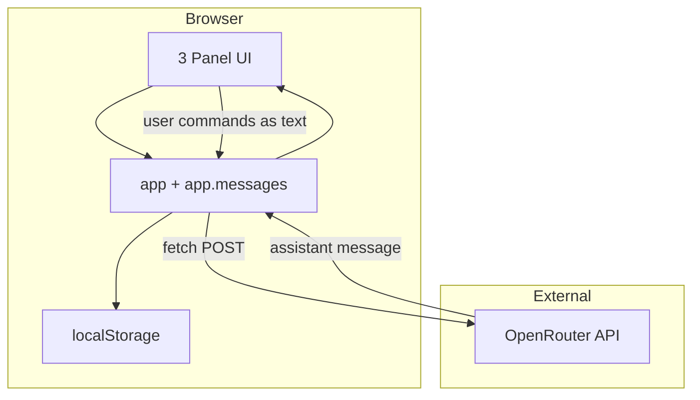
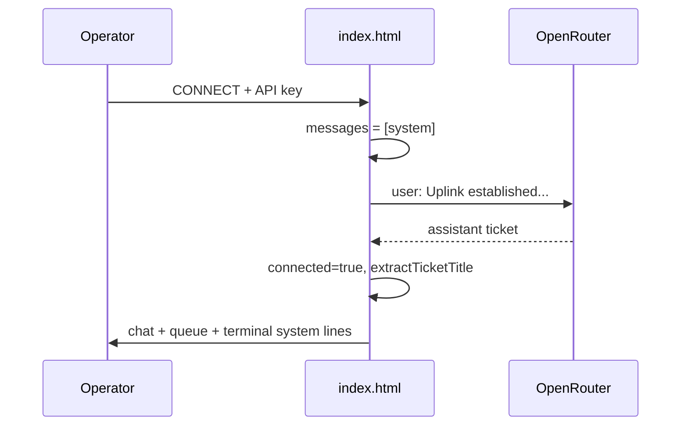
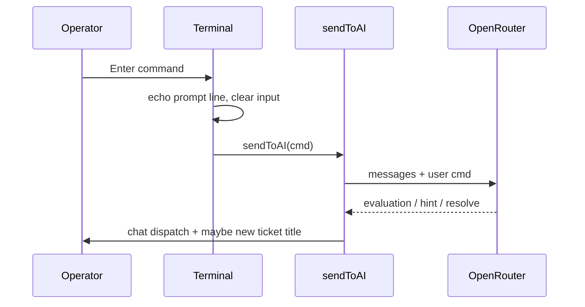

# ARCHITECTURE.md — TARTARUS UPLINK technical map

Single-file client app. No server component.

---

## System context



---

## User flows

### 1. Connect (uplink establish)



### 2. Troubleshoot (terminal)



---

## Layout grid

| Column | `lg:col-span` | Sections |
|--------|---------------|----------|
| Left | 3 | Operator Status, Ticket Queue |
| Center | 5 | Terminal output + input |
| Right | 4 | Uplink config, Dispatch chat |

Colors (CSS variables + Tailwind arbitrary):

| Token | Hex | Usage |
|-------|-----|--------|
| bg | `#050505` | Page background |
| green | `#00ff41` | Primary text, prompts, dispatch |
| amber | `#ffb000` | Warnings, operator chat, sanity |
| red | `#ff003c` | Errors, offline LED |

---

## State machine (connection)

```
OFFLINE --[CONNECT success]--> ONLINE
ONLINE --[fetch start]--> BUSY (LED amber, inputs disabled)
BUSY --[fetch end]--> ONLINE
OFFLINE --[CONNECT fail]--> OFFLINE (messages reset to [system] only)
```

`app.connected` is true only after the **first successful** completion in `handleConnect`.

---

## Message history model

OpenRouter expects:

```json
[
  { "role": "system", "content": "<SYSTEM_PROMPT exact>" },
  { "role": "user", "content": "..." },
  { "role": "assistant", "content": "..." }
]
```

- `callOpenRouter` sends `[...app.messages, newUserMessage]` then on success pushes **both** user and assistant onto `app.messages`.
- Re-connect resets history to `[system]` only.

---

## Ticket title extraction

`extractTicketTitle(text)` runs on **assistant** replies only. Priority:

1. `TICKET:` / `TICKET #N:` patterns
2. Markdown `##` or `**bold**`
3. `Subject:` / `Ticket:` / `Issue:`
4. First sensible line (3–80 chars, not greeting)

`updateQueue(title)` triggers `.glitch-active` on `#app-root` when title changes (including first ticket from empty).

---

## API key sources (priority on load)

1. `localStorage.tartarus_api_key` (if user connected before)
2. `GET /api/config` → `{ openRouterApiKey }` from `server.mjs` reading `.env` `OPENROUTER_API_KEY`
3. Manual paste in UI

## localStorage

| Key | Set when |
|-----|----------|
| `tartarus_api_key` | Connect |
| `tartarus_model` | Connect, model dropdown change |

Loaded on `init()` into form fields.

---

## CSS layers

| Layer | Mechanism |
|-------|-----------|
| Scanlines | `.crt-screen::before` fixed overlay |
| Vignette | `.crt-screen::after` radial gradient |
| Panels | `.panel` border + inset glow |
| Glitch | `#app-root.glitch-active` keyframes 400ms |
| Text glow | `body { text-shadow: ... }` |

---

## Extension points (recommended hooks)

| Hook | Location | Idea |
|------|----------|------|
| `bootTerminal()` | init | More fake boot logs |
| `driftStats()` | after resolve | Tie stats to ticket difficulty |
| `mapError(err)` | catch blocks | User-friendly OpenRouter errors |
| `extractTicketTitle` | post-reply | JSON block fallback if prompt ever changes |
| Terminal form submit | init listener | Built-in `help`, `history`, `clear` |

---

## Security model

- API key in browser memory + `localStorage` — XSS would expose key; keep DOM insertion sanitized (`escapeHtml` for chat).
- No CSP headers defined (static file).
- CORS: OpenRouter allows browser origin when served over HTTP(S).

---

## Performance

- Full chat history sent each request — may grow large; future: summarize or trim old turns (ask user first).
- Tailwind CDN parses on load — acceptable for toy scale.

---

## Dependencies (CDN)

| Resource | URL pattern |
|----------|-------------|
| Tailwind | `cdn.tailwindcss.com` |
| Fonts | `fonts.googleapis.com` (JetBrains Mono, Fira Code) |
| API | `openrouter.ai/api/v1/chat/completions` |

No version pins — document if reproducibility becomes an issue.
