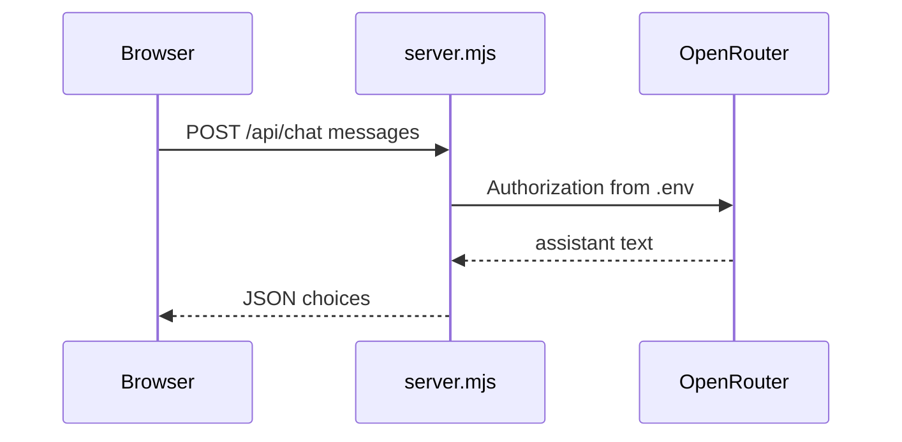

# ARCHITECTURE.md — TARTARUS UPLINK v3

## Request flow

`GET /api/config` → `{ hasKey: boolean }` only.

## Client modules

| Module | Exports |
|--------|---------|
| `state.js` | `app`, `els`, `bindElements` |
| `prompts.js` | `buildSystemMessages()` |
| `openrouter.js` | `callChat`, `mapError`, `fetchServerConfig` |
| `parsers.js` | title/debrief/next-step parsers |
| `progress.js` | load/save progress, field notes |
| `curriculum.js` | load JSON, track helpers |
| `ui.js` | DOM, chat, terminal, focus, reference |
| `terminal.js` | help/clear/history, autocomplete |
| `app.js` | init, connect, sendToAI |

## Progress schema

`localStorage.tartarus_progress_v1`:

- `ticketsClosed`, `skillsSeen[]`, `fieldNotes[]`, `currentTrack`, `currentLevel`, `lastSession`

## Chill UX hooks

- `sendToAI(..., 'hint'|'stuck')` — no operator line in chat for hidden prompts
- `isTicketResolved` → pulse queue + field note + increment tickets
- `body.focus-mode` — hides uplink config, dims chat

## Static hosting

Document root: `public/`. No root `index.html` — use dev server only for full features.
